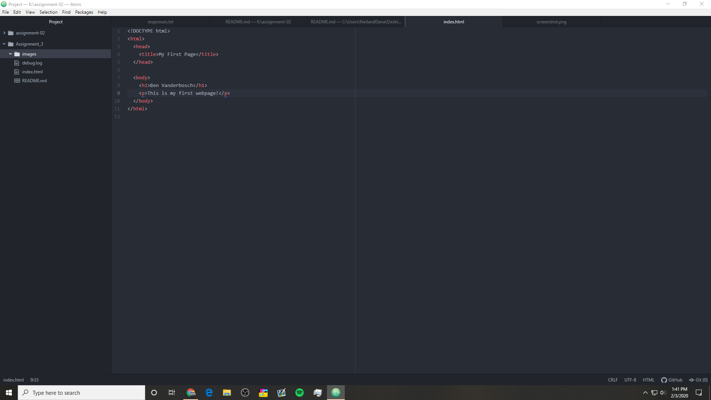

# Assignment-03
## Ben Vanderbosch

You send a request over the network to a server. It responds with a collection of web content. The browser interprets the content returned and displays it as a webpage. I currently use Google Chrome

Markup language is a way to annotate text in a way that text is distinguishable from it. HTML is a markup language.

