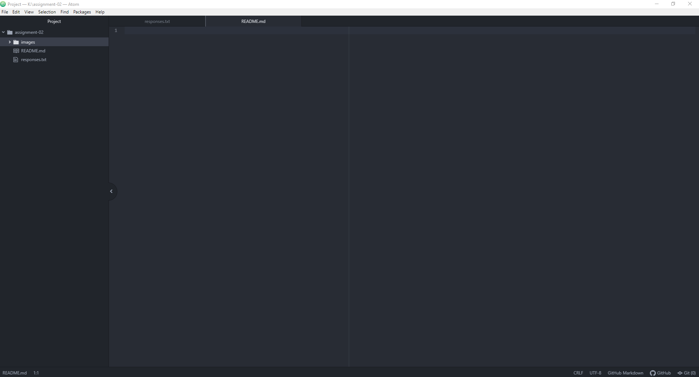

# Assignment-02
## Ben Vanderbosch

I decided to take this class because it is required for my major and I thought that it would be a fun challenge for me because unlike my Adobe CC classes, I have no experience in coding.

I have learned:

- what Atom is
- what GitHub is

I hope to learn:

- Enough about coding so that I can do it on my own

[Moodle](https://moodle.umt.edu/)

[My Responses](./responses.txt)

