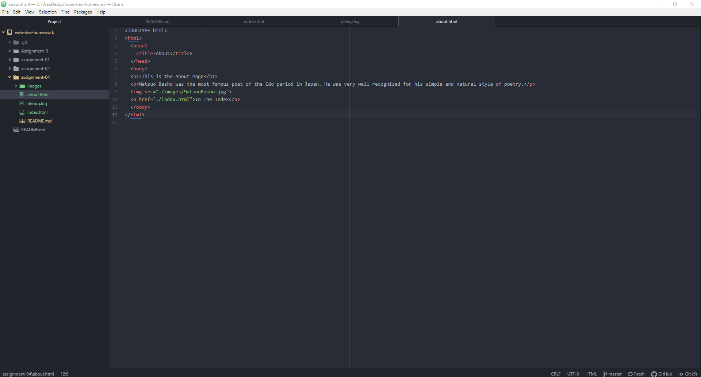

# Assignment 04
## Benjamin Vanderbosch

I went to YouTube.com. It was very different than it is today. It was basically just a screen of link text of varying sizes without a whole lot of organization. YouTube today is definitely more optimized for the user. Everything it laid out well and they have put things into sections so I can easily find videos that I may be interested in.

My experience with the GIT module has been very good. I have learned a lot about how much work goes into making a website function and how much attention to detail one must have. It's been a little difficult for me to remember things that I always need especially for html but it's not so bad. I seem to be understanding things a lot more now that I have had a decent amount of practice.

