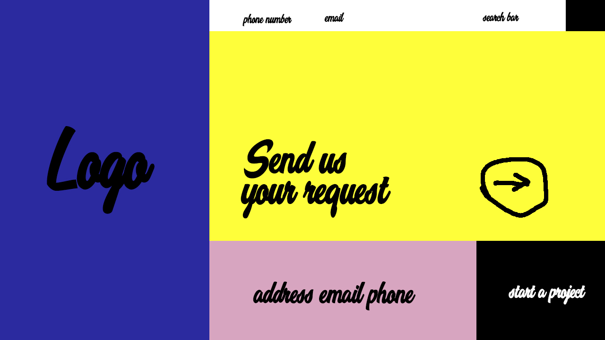

Padding is the space between the content and the border of the div. Margin is the space between the div and the edges of the page. A border is something that goes around the div.

I started by browsing the Awwwards website for a website I wanted to model mine after. I chose the Kommigraphics In SOTD site and made a mockup in Photoshop. I then arranged my containers in the way that I wanted to which was way way harder than I thought it would be so I had to sacrifice a little in my design because it was just going to be too difficult and time consuming. Then I filled dummy info into the various containers so that it looked more put together.  
